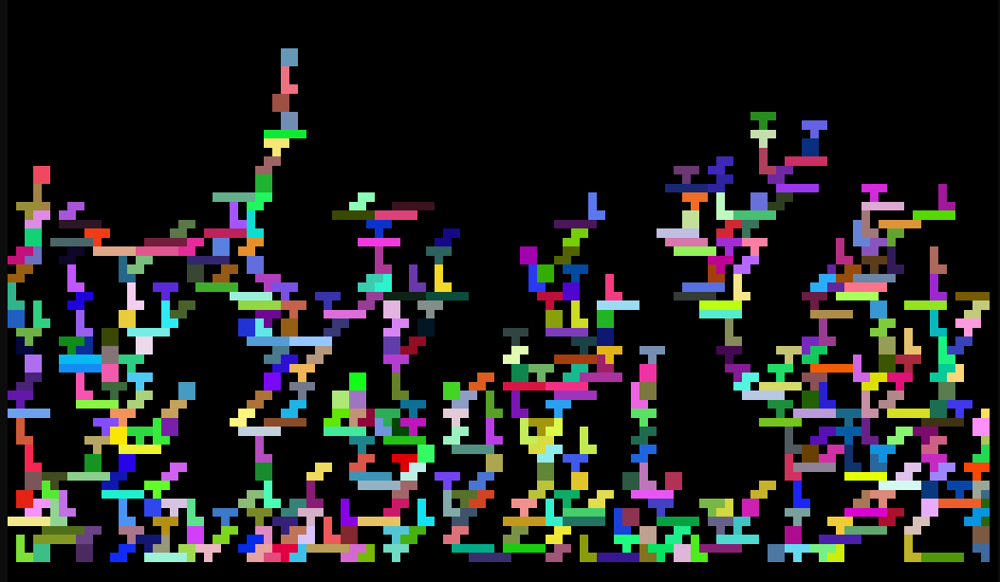

# 💻 Tetromino CLI ⚙️

## Overview

The `tetromino_cli` is a very simple demonstration of the Crossterm Output Driver for PixelLoop, which allows rendering to a shell console using unicode characters and ansi colors.

## Build Instructions

To build the Tetromino CLI run `cargo build --release`.

## Usage

Once built, run the `targets/release/tetromino_cli` binary to start the demo.  
Press `space` to spawn randomize colors tetris and `q` to exit.

